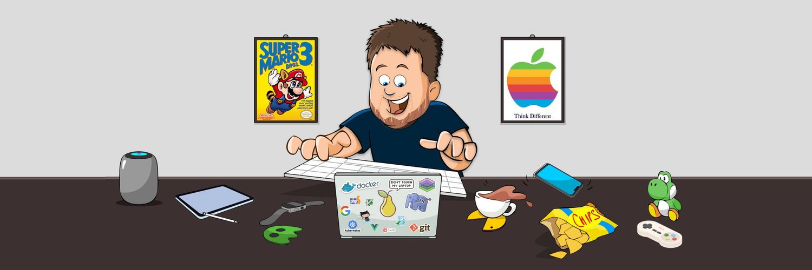

## Hey 👋🏻 I'm Daniel Bahl 👨‍💻

<picture>
  <source media="(prefers-color-scheme: dark)" srcset="./assets/github-snake-dark.svg" />
  <source media="(prefers-color-scheme: light)" srcset="./assets/github-snake.svg" />
  
</picture>
  
### About me

Navigating the crossroads of code and entrepreneurship, I bring your tech dreams to life through my hosting-company Hippoways™. When I'm not elbows-deep in code, you'll find me crafting YouTube content, enjoying life with my two kids and wife, or searching for the perfect balance between serious and playful 🛠️🎥🎮

## Newest Blogposts on piraffe.com

<!-- BLOG-POST-LIST:START -->
<!-- BLOG-POST-LIST:END -->  

### A Peek into My World:

- 🛠 &nbsp; On the workbench: PHP, JavaScript/TypeScript, Deno, Astro SSG, MySQL, MongoDB, Goland and some Rust. Making the web a better place, one line of code at a time 😅🤣
- 🚀 &nbsp; Currently nerding out: Playing with OpenAI GPT-4 API in my projects 🤖
- 👨‍💻 &nbsp; Want a tour of my code? Check out my projects on [Github](https://github.com/DanielBahl).
- 📝 &nbsp; When I'm not coding or running my business, I'm [blogging](https://piraffe.com) about it. Get in on the insights!
- 🎮 &nbsp; <code>if () {</code> or <code>if () \n{</code> - I'm team one-liner
- 📬 &nbsp; Got questions or just want to say hi? Shoot me a DM at [𝕏](https://x.com/danielbahl/), [Instagram](https://instagram.com/girafpingvin/) or github-dm@danielbahl.com

### The Joys of My Life:

- 👨‍👩‍👧‍👦 &nbsp; Nothing beats being a dad to my beautiful girl Tilde, son Magnus, and a loving husband to wife Rikke is my #1 joy. ❤️
- 💻 &nbsp; A true techie at heart, I'm always diving into new stacks and churning out some slick code.
- 📰 &nbsp; If I'm not writing code, I'm writing about it. Gotta love tech blogs, right?
- 🍕 &nbsp; Hackathons are our mid-week office party! We host them every Wednesday at my company. But Thursdays? Those are sacred; they're my days off.

### Goals for 2024 🎯

- 📖 &nbsp; Transition to Open Source: Aim to make more of my current closed-source projects available on GitHub. Time to share the love! 😥➡️😃
- 🚀 &nbsp; Finally Launch duck.tools: Been sitting on this domain for two years. 2024 is the year it takes flight! 🦆🛠️
- 🎥 &nbsp; Reach 5K Danish YouTube Subscribers: Time to ramp up the video content and grow the online community. 📈
- 📊 &nbsp; Scale my business, grow the team, and make our services even better. 💼💰

Big dreams for a big year ahead! 🌟

### Languages and Tools:

#### Languages:

<code></code>
   

#### Databases: 

 

#### Tools:

<br/ >

### Projects and Dev Stuffs: 

	
  
<b>⚡ Github Stats</b>

  
  

  
<b>🧑‍🚀 Projects</b>

   
  <table>
    <thead align="center">
      <tr border: none;>
        <td><b>💻 Projects</b></td>
        <td><b>🌟 Stars</b></td>
        <td><b>🍴 Forks</b></td>
        <td><b>🐛 Issues</b></td>
        <td><b>🔔 Pull Requests</b></td>
        <td><b>👨‍💻 Language</b></td>
      </tr>
    </thead>
    <tbody>
      <tr>
	<td><a href="https://shareshortcuts.com"><b>🧍ShareShortcuts.com</b></a></td>
        <td></td>
        <td></td>
        <td></td>
        <td></td>
        <td></td>
      </tr>
    </tbody>
  </table>
   

 

	
   
  
<b>⚙️ My "Get Stuff Done" Software List:</b>

  	<ul>
  	  <li><b>OS:</b> macOS and iPad OS</li>
      <li><b>Notes:</b> Obisdian</li>
      <li><b>Tasks:</b> Todoist</li>
      <li><b>Terminal:</b> Warp</li>
      <li><b>Video Editing:</b> Final Cut Pro X</li>
  	  <li><b>Browser: </b> Arc Browser</li>
	  <li><b>Code Editor:</b> Visual Studio Code</li>
	  <li><b>To Stay Updated:</b> 𝕏, RSS and YouTube</li>
	</ul>
	<b>Read more about it on my website <a target="_blank" rel="norefferer noopener" href="https://piraffe.com/">piraffe.com</a></b>

 

---

### Thank you for reading, Share your ❤️ by starring some of the repositories! 🌟

