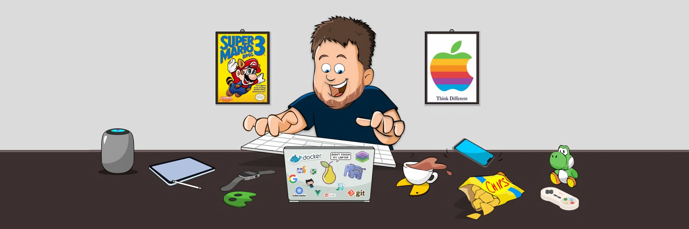

## Hey 👋🏻 I'm Daniel Bahl 👨‍💻

<picture>
  <source media="(prefers-color-scheme: dark)" srcset="./assets/github-snake-dark.svg" />
  <source media="(prefers-color-scheme: light)" srcset="./assets/github-snake.svg" />
  
</picture>
  
### About me

Navigating the crossroads of code and entrepreneurship, I bring your tech dreams to life through my hosting-company Hippoways™. When I'm not elbows-deep in code, you'll find me crafting YouTube content, enjoying life with my two kids and wife, or searching for the perfect balance between serious and playful 🛠️🎥🎮

### 💥 Latest Blog Posts from danielbahl.com
<!-- BLOG-POST-LIST:START -->
 - ✍🏻 <a href='https://danielbahl.com/tech/easyfind-on-macos-when-spotlight-fails-and-terminal-is-too-much?ref=github'>EasyFind on macOS: When Spotlight Fails and Terminal Is Too Much</a>
 - 🔥 <a href='https://danielbahl.com/tech/password-remember-a-user-friendly-password-manager?ref=github'>Password Remember: a user-friendly password manager that remembers what you forget</a>
 - 🔥 <a href='https://danielbahl.com/tech/from-online-backend-to-fully-offline-how-i-embed-an-updated-word-database-in-my-bedrager-app-for-ios-and-android?ref=github'>From Online Backend to Fully Offline: How I Embed an Updated Word Database in My Bedrager App for iOS and Android</a>
 - 🚀 <a href='https://danielbahl.com/tech/bash-aliases-make-your-terminal-smarter-with-shortcuts?ref=github'>Bash Aliases: Make Your Terminal Smarter with Shortcuts</a><!-- BLOG-POST-LIST:END -->
<!-- BLOG-POST-LIST:END -->

### Latest Feed Posts from danielbahl.com
<!-- FEED-POST-LIST:START -->
 - ✍🏻 <a href='https://danielbahl.com/feed/goodbye-to-mac-pro-after-20-years?ref=github'>Goodbye to Mac Pro after 20 years</a>
 - 🔥 <a href='https://danielbahl.com/feed/ios-26-4-has-landed-here-s-what-s-new?ref=github'>iOS 26.4 has landed: Here’s what’s new</a>
 - 🔥 <a href='https://danielbahl.com/feed/apple-announces-wwdc-2026-from-june-8-to-12?ref=github'>Apple announces WWDC 2026 from June 8 to 12</a>
 - 🚀 <a href='https://danielbahl.com/feed/steve-jobs-is-speaking-at-the-apple-campus-again?ref=github'>Steve Jobs is speaking at the Apple campus again</a>
 - 🥳 <a href='https://danielbahl.com/feed/app-makes-your-macbook-scream-back?ref=github'>App makes your MacBook scream back</a>
 - 🎉 <a href='https://danielbahl.com/feed/google-launches-stitch-for-ai-powered-ui-design?ref=github'>Google launches Stitch for AI-powered UI design</a>
 - 👨‍💻 <a href='https://danielbahl.com/feed/10-audio-improvements-in-apple-s-new-airpods-max-2?ref=github'>10 audio improvements in Apple’s new AirPods Max 2</a>
 - 👨‍💻 <a href='https://danielbahl.com/feed/street-guitarist-speechless-over-the-guitar-he-gets?ref=github'>Street guitarist speechless over the guitar he gets</a>
 - 🎉 <a href='https://danielbahl.com/feed/google-maps-gets-a-major-ai-update-in-the-us?ref=github'>Google Maps gets a major AI update in the US</a>
 - 👀 <a href='https://danielbahl.com/feed/my-new-password-app-is-now-live-on-the-app-store?ref=github'>My new password app is now live on the App Store</a>
 - 🚀 <a href='https://danielbahl.com/feed/qr-codes-for-testing-otp-in-a-password-manager?ref=github'>QR codes for testing OTP in a password manager</a>
 - 👨‍💻 <a href='https://danielbahl.com/feed/blackberry-impresses-10-10-from-an-enthusiastic-viewer?ref=github'>BlackBerry impresses: 10/10 from an enthusiastic viewer</a>
 - 🔥 <a href='https://danielbahl.com/feed/over-10-new-features-coming-in-ios-27?ref=github'>Over 10 new features coming in iOS 27</a>
 - 😜 <a href='https://danielbahl.com/feed/new-macbook-neo-wallpapers-are-coming-to-all-macs?ref=github'>New MacBook Neo wallpapers are coming to all Macs</a>
 - 🚀 <a href='https://danielbahl.com/feed/wikipedia-is-losing-traffic-to-ai-and-social-videos?ref=github'>Wikipedia is losing traffic to AI and social videos</a>
 - 👀 <a href='https://danielbahl.com/feed/john-ternus-is-rumored-to-be-apple-s-next-top-boss?ref=github'>John Ternus is rumored to be Apple’s next top boss</a>
 - ✍🏻 <a href='https://danielbahl.com/feed/weak-sales-delay-the-next-generation-of-iphone-air?ref=github'>Weak sales delay the next generation of iPhone Air</a>
 - ⭐ <a href='https://danielbahl.com/feed/cherri-makes-shortcuts-much-easier-to-build?ref=github'>Cherri makes Shortcuts much easier to build</a>
 - 🥳 <a href='https://danielbahl.com/feed/30-new-starling-nest-boxes-are-being-put-up-along-the-country-roads?ref=github'>30 new starling nest boxes are being put up along the country roads</a>
 - 😜 <a href='https://danielbahl.com/feed/valve-teases-new-hardware-that-challenges-the-tech-giants?ref=github'>Valve teases new hardware that challenges the tech giants</a>
 - 👀 <a href='https://danielbahl.com/feed/tesla-on-course-for-a-billion-dollar-ai-fiasco?ref=github'>Tesla on course for a billion-dollar AI fiasco</a>
 - 👀 <a href='https://danielbahl.com/feed/new-employee-gets-a-macbook-air-m4-at-the-startup?ref=github'>New employee gets a MacBook Air M4 at the startup</a>
 - 🔥 <a href='https://danielbahl.com/feed/php-8-5-is-approaching-with-the-pipe-operator-and-changes?ref=github'>PHP 8.5 is approaching with the pipe operator and changes</a>
 - ✍🏻 <a href='https://danielbahl.com/feed/samsung-s-galaxy-xr-headset-is-now-on-sale?ref=github'>Samsung’s Galaxy XR headset is now on sale</a>
 - ⭐ <a href='https://danielbahl.com/feed/openai-buys-the-creators-of-shortcuts-for-deep-mac-integration?ref=github'>OpenAI buys the creators of Shortcuts for deep Mac integration</a>
 - 🥳 <a href='https://danielbahl.com/feed/iphone-17-pro-impresses-in-new-teardown-video?ref=github'>iPhone 17 Pro impresses in new teardown video</a>
 - 👀 <a href='https://danielbahl.com/feed/apple-might-skip-iphone-19-and-jump-straight-to-xx?ref=github'>Apple might skip iPhone 19 and jump straight to XX</a>
 - ⚡️ <a href='https://danielbahl.com/feed/liquid-glass-tab-bar-for-the-web-is-tempting-as-a-weekend-project?ref=github'>Liquid Glass tab bar for the web is tempting as a weekend project</a>
 - 👨‍💻 <a href='https://danielbahl.com/feed/claude-gets-memory-with-optional-activation?ref=github'>Claude gets memory with optional activation</a>
 - ⚡️ <a href='https://danielbahl.com/feed/test-does-liquid-glass-affect-the-battery-in-ios-26-1?ref=github'>Test: Does Liquid Glass affect the battery in iOS 26.1?</a><!-- FEED-POST-LIST:END -->

### A Peek into My World:

- 🛠 &nbsp; On the workbench: Swift, PHP, Golang, JavaScript/TypeScript, MySQL, MongoDB and some Rust. Making the web and App Store a better place, one line of code at a time 😅🤣
- 🚀 &nbsp; Currently nerding out: My soon-to-be-released Read-later app codename "http"
- 👨‍💻 &nbsp; Want a tour of my code? Check out my projects on [Github](https://github.com/DanielBahl).
- 📝 &nbsp; When I'm not coding or running my business, I'm [blogging](https://danielbahl.com) about it. Get in on the insights!
- 🎮 &nbsp; <code>if () {</code> or <code>if () \n{</code> - I'm team one-liner
- 📬 &nbsp; Got questions or just want to say hi? Shoot me a DM at [𝕏](https://x.com/danielbahl/), [Instagram](https://instagram.com/girafpingvin/) or github-dm@danielbahl.com

### The Joys of My Life:

- 👨‍👩‍👧‍👦 &nbsp; Nothing beats being a dad to my beautiful girl Tilde, son Magnus, and a loving husband to wife Rikke is my #1 joy. ❤️
- 💻 &nbsp; A true techie at heart, I'm always diving into new stacks and churning out some slick code.
- 📰 &nbsp; If I'm not writing code, I'm writing about it. Gotta love tech blogs, right?
- 🍕 &nbsp; Hackathons are our mid-week office party! We host them every Wednesday at my company. But Thursdays? Those are sacred; they're my days off.

Big dreams for a big year ahead! 🌟

### Languages and Tools:

#### Languages:

   

#### Databases: 

 

#### Tools:

<br/ >

### Projects and Dev Stuffs: 

	
  
<b>⚡ Github Stats</b>

	
  
  

  
<b>🧑‍🚀 Projects</b>

   
  <table>
    <thead align="center">
      <tr border: none;>
        <td><b>💻 Projects</b></td>
        <td><b>🌟 Stars</b></td>
        <td><b>🍴 Forks</b></td>
        <td><b>🐛 Issues</b></td>
        <td><b>🔔 Pull Requests</b></td>
        <td><b>👨‍💻 Language</b></td>
      </tr>
    </thead>
    <tbody>
      <tr>
	<td><a href="https://shareshortcuts.com"><b>🩳 ShareShortcuts.com</b></a></td>
        <td></td>
        <td></td>
        <td></td>
        <td></td>
        <td></td>
      </tr>
      <tr>
	<td><a href="https://appghost.com"><b>👻 Appghost.com</b></a></td>
        <td></td>
        <td></td>
        <td></td>
        <td></td>
        <td></td>
      </tr>
    </tbody>
  </table>
   

 

	
   
  
<b>⚙️ My "Get Stuff Done" Software List:</b>

  	<ul>
  	  <li><b>OS:</b> macOS and iPad OS</li>
      <li><b>Notes:</b> Obisdian</li>
      <li><b>Tasks:</b> Todoist</li>
      <li><b>Terminal:</b> Warp</li>
      <li><b>Video Editing:</b> Final Cut Pro X</li>
  	  <li><b>Browser: </b> Arc Browser</li>
	  <li><b>Code Editor:</b> Visual Studio Code</li>
	  <li><b>To Stay Updated:</b> 𝕏, RSS and YouTube</li>
	</ul>
	<b>Read more about it on my website <a target="_blank" rel="norefferer noopener" href="https://piraffe.com/">piraffe.com</a></b>

 

---

### Thank you for reading, Share your ❤️ by starring some of the repositories! 🌟

